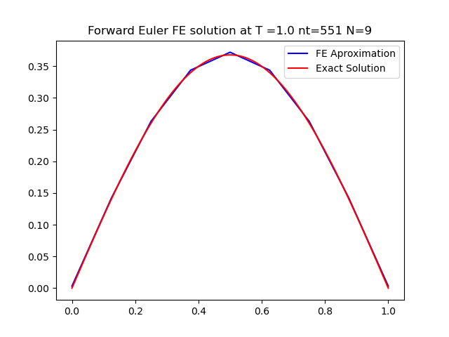

#A software to find a numerical solution for the 1D heat transfer problem

Weak Form Derivation:

I used this derivation to help create the algorithms to solve the problem numerically.
Within the project2 folder are two files
  project2_BE.py
    This is the backwards euler method aproach to the problem
  project2_FE.py
    This is the Forward euler method aproach to the problem

Forward Euler
Changing timestep

As can be seen above, the Forward Euler solution was unstable for dt=1/551 and N=11.

By reducing the time step, we can begin to get more accurate solutions:

If we reduce the timestep further, we see the FE solution converges closer to the real solution:

For N=11, the Forward Euler method begins to fail for timesteps greater than 1/561.

Keeping the timestep constant at 1/551, we tried increasing the number of nodes:

Backwards Euler method
