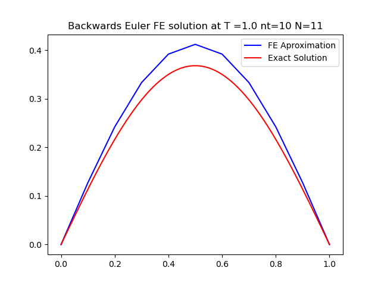

# Numerical Solution for the 1D Heat Transfer Problem

This project demonstrates the numerical solution of the 1D heat transfer problem using both Forward Euler and Backward Euler methods. 

---

## Weak Form Derivation

The weak form derivation, which serves as the foundation for creating the numerical solution algorithms, is shown below:

---

## Project Structure

Within the `project2` folder are two Python files:

- **`project2_BE.py`**: Implements the Backward Euler method for solving the problem.
- **`project2_FE.py`**: Implements the Forward Euler method for solving the problem.

---

## Forward Euler Method

### Changing Time Step

1. **Unstable Solution for (Delta t = 1/551, N = 11\):**

   

   The Forward Euler solution was unstable for this number of nodes and timestep.

2. **Improving Stability by Reducing Time Step:**

   

   By reducing the time step to 1/561, the solution becomes more stable. For timesteps greater than 1/561, the forward euler began to fail to produce stable solutions.

3. **Further Time Step Reduction:**

   

   Further reducing dt to 1/571, we observe increased accuracy.

4. **Effect of Node Count on Stability and Accuracy (Keeping dt = 1/551):**

   - \( N = 11 \):
     
     

   - \( N = 10 \):
     
     

   - \( N = 8 \):
     
     

   - \( N = 5 \):
     
     

   As the number of nodes decreases, the Forward Euler method becomes stable for larger time steps, but the accuracy diminishes.

5. **Stable Solution with Fewer Nodes for Larger dt:**

   

   Reducing the node count allows the Forward Euler method to remain stable, even for much larger dt, but at the cost of accuracy.

---

## Backward Euler Method

1. **Stable Solution for ( N = 11, dt = 1/551 ):**

   

   The Backward Euler method provides stable solutions for time steps and node numbers that were unstable with Forward Euler.

2. **High Accuracy with Increased Node Count (N = 600):**

   

   By increasing N, we obtain highly accurate solutions using the Backward Euler method.

3. **Decreasing Accuracy for dt's that are greater than dx:**

   

   While Backward Euler remains stable even with large time steps, the solution's accuracy diminishes significantly as dt becomes larger than the spacial step size. This is likely because as dt gets large compared to the spacial timestep, the slope of the solution changes more sharply between each time step, so the model does not accuratly aproximate these gradients and loses accuracy.

---

## Summary

- **Forward Euler Method:** 
  - Sensitive to the time step and node count.
  - Unstable for larger time steps but becomes stable by reducing dt or N.
  - Accuracy decreases with fewer nodes but lowering the number of nodes can allow for stable solutions with larger timesteps.

- **Backward Euler Method:** 
  - Always stable, even for large time steps.
  - Accuracy improves with more nodes.
  - As the timestep becomes greater than the spacial step size, solutions remain stable but lose accuracy.

---

Thanks for being a great teacher this semester!
